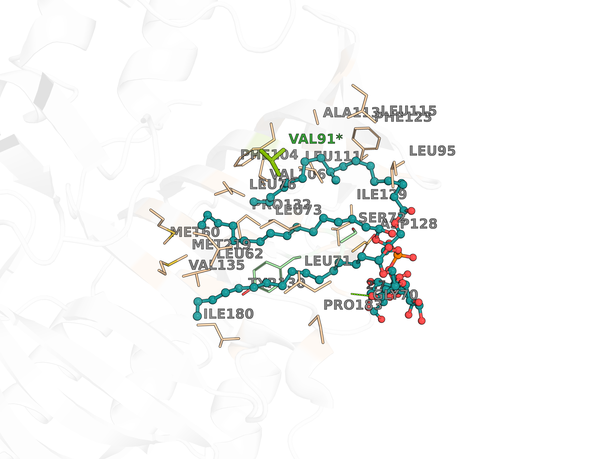
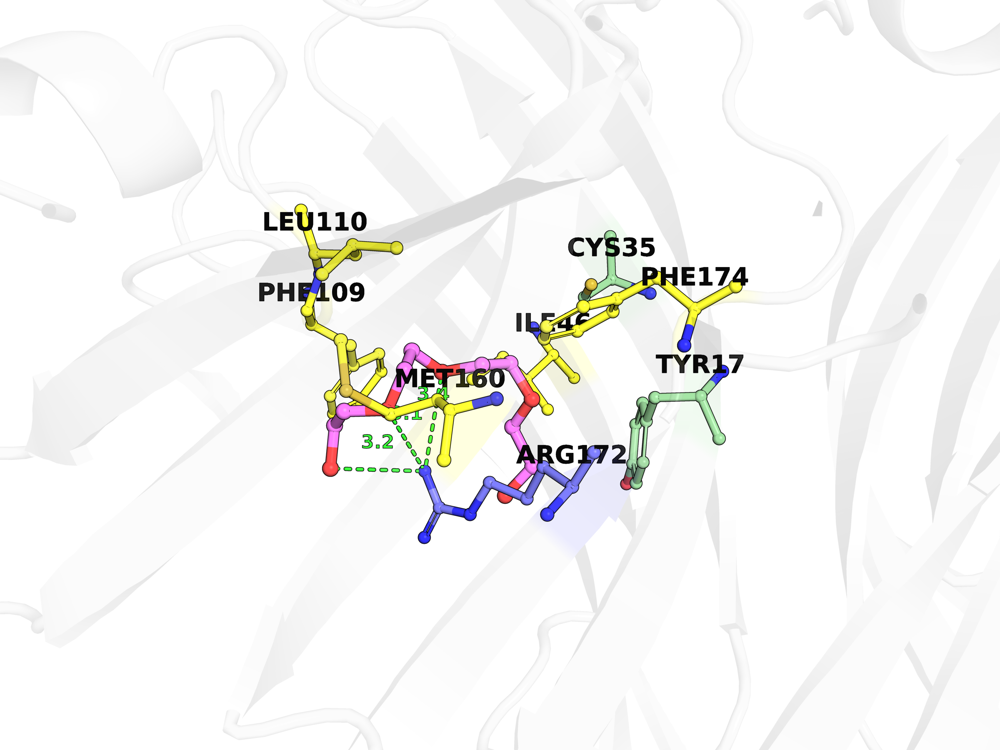
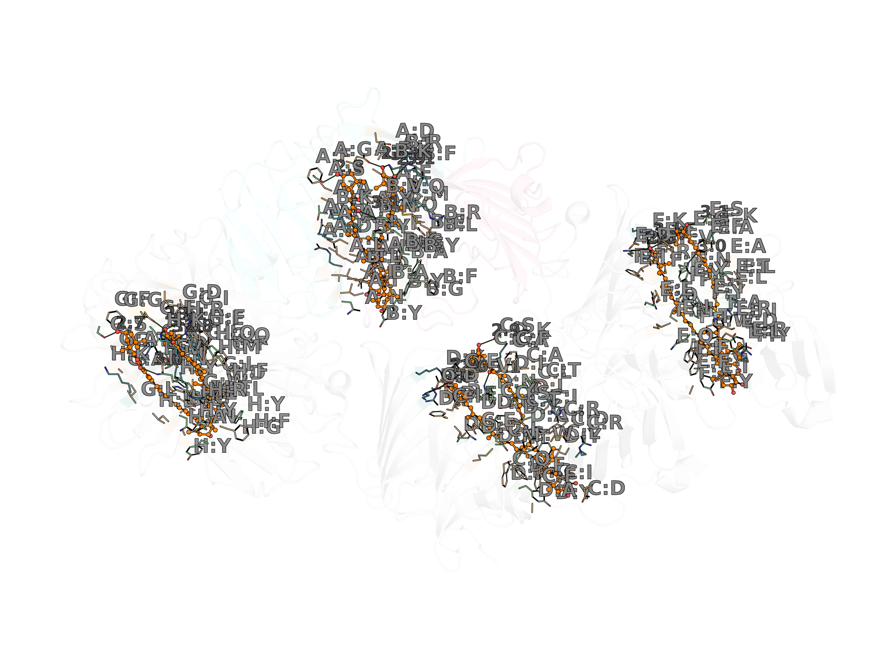

#  Binding Pocket Visualization

[](https://pymol.org)
[](LICENSE)

PyMOL scripts for visualizing ligand-binding pockets with experimental mutagenesis validation overlays.

<p align="center">
  <!-- 💡 After running: replace with actual screenshots
       e.g. lprg_tag, vioe_peg, epd_axt side by side -->
  
  
  
</p>
<p align="center"><sub>LprG·TAG (4ZRA) · VioE·PEG (3BMZ) · EPD-BCP1·AXT (8I34)</sub></p>

## Structures

| Function | Protein | Ligand | PDB | Resolution | Reference |
|---|---|---|---|---|---|
| `lprg_tag()` | LprG | Triacylglyceride | 4ZRA | 1.8 Å | Martinot 2016 |
| `lprg_pim2()` | LprG | Ac₁PIM₂ | 3MHA | 2.4 Å | Drage 2010 |
| `vioe_ppa()` | VioE | Phenylpyruvic acid | 2ZF4 | 2.1 Å | Hirano 2008 |
| `vioe_peg()` | VioE | PEG | 3BMZ | 1.21 Å | Ryan 2008 |
| `epd_axt()` | EPD-BCP1 | Astaxanthin | 8I34 | 2.4 Å | Kawasaki 2023 |
| `lppx()` | LppX | (apo cavity) | 2BYO | 2.4 Å | Sulzenbacher 2006 |
| `lola()` | LolA | (apo cavity) | 2ZPC | 1.65 Å | Okuda 2008 |
| `rseb()` | RseB | MES | 2V42 | 2.2 Å | Wollmann 2007 |

## Features

- **Sidechain-tip labeling** — labels placed at terminal sidechain atoms, not Cα, so they naturally spread outward and avoid overlap
- **Mutagenesis validation** — experimentally validated residues colored green with asterisk; structural-only contacts in gray
- **Four label modes** — `"full"` (ARG172), `"short"` (R172), `"letter"` (R), `"number"` (172); multi-chain structures get chain prefixes (A:R)
- **Interactive toggles** — switch views on the fly without reloading
- **Ball-and-stick ligands** — visually separated from residue sticks
- **H-bond dashes** — polar contacts shown with green dashed lines and distance labels
- **Publication-ready** — auto-saves 2400×1800 ray-traced PNGs at 300 DPI

## Usage

```
# In PyMOL
run lola_pockets.py

# Load a structure
lprg_tag

# Switch label modes interactively
relabel short
relabel letter

# Toggle labels
label_key_only        # only mutagenesis-validated
show_all_labels       # everything
hide_all_labels       # clean figure for export
label_one 172         # toggle a single residue

# Any PDB
pocket 4ZRA
```

## Validated Residues

### VioE (Ryan 2008, Hirano 2008)
| Residue | Mutant | Activity | Role |
|---|---|---|---|
| Arg172 | R172A | 8% | Catalytic, base of pocket |
| Glu66 | E66A | ~25% | Distal end of active site |
| Ser19 | S19A | ~30% | Substrate binding |
| Phe50 | F50A | ~35% | Hydrophobic packing |
| Tyr17 | Y17F | ~40% | Substrate binding |
| Asn51 | N51A | ~45% | Polar contact |

### LprG (Drage 2010)
| Residue | Evidence | Effect |
|---|---|---|
| Val91 | V91W mutagenesis | Blocks PIM₂ and TAG binding |
| Gly42 | Crystal structure (3MHA) | H-bond to mannose (2.7 Å) |
| Asp100 | Crystal structure (3MHA) | H-bond to phosphate (3.0 Å) |
| Tyr102 | Structural analysis | Gatekeeper residue |

## Requirements

- [PyMOL](https://pymol.org) 2.5+ (open-source or incentive)
- Internet connection (fetches PDB files on first run; cached to `/tmp/pdb_cache`)

## License

MIT
